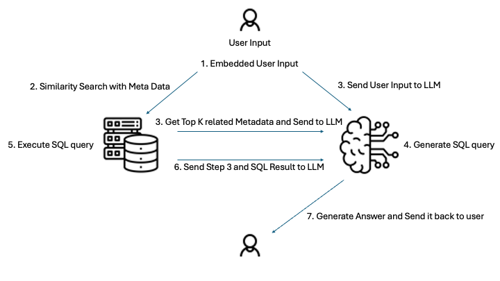
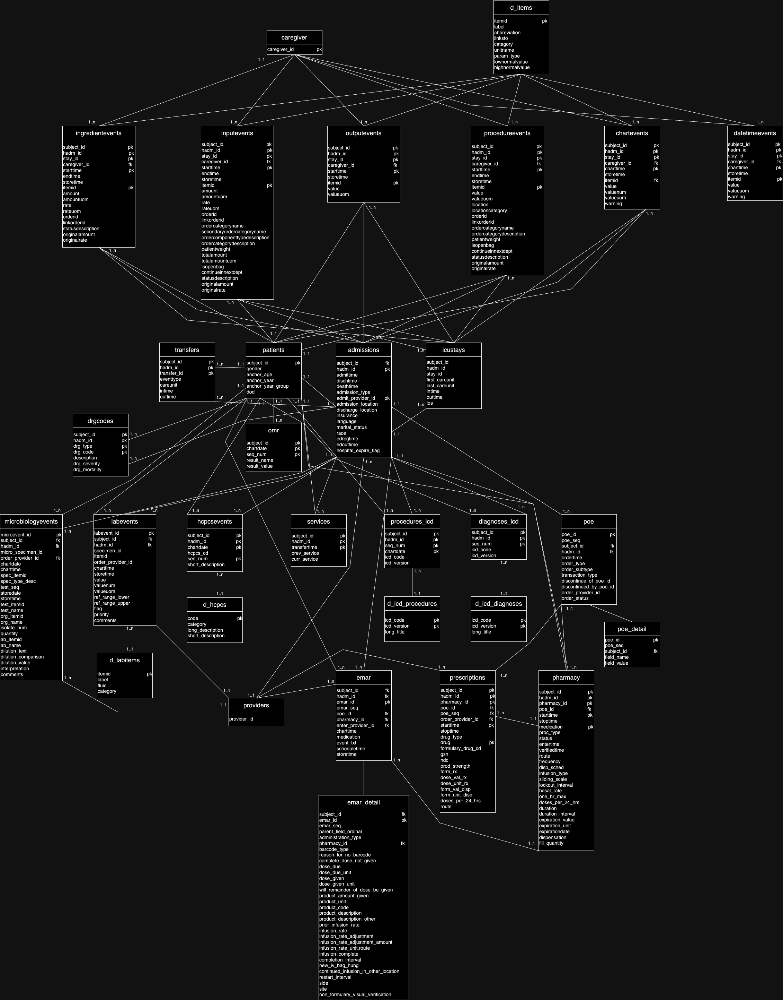

# SQL Retrieval-Augmented Generation Pipeline for MIMIC-IV Hospital Data

## Table of Contents
- [Project Overview and Motivation](#project-overview-and-motivation)
- [System Architecture and Workflow](#system-architecture-and-workflow)
  - [1. Query Embedding & Table Retrieval](#1-query-embedding--table-retrieval)
  - [2. Relevance Filtering and Query Classification](#2-relevance-filtering-and-query-classification)
  - [3. Prompt Construction with Retrieved Metadata](#3-prompt-construction-with-retrieved-metadata)
  - [4. SQL Generation with GPT-4](#4-sql-generation-with-gpt-4)
  - [5. SQL Validation and Automatic Correction](#5-sql-validation-and-automatic-correction)
  - [6. Query Execution on the Database](#6-query-execution-on-the-database)
  - [7. Results Summarization in Natural Language](#7-results-summarization-in-natural-language)
- [Technologies and Models Used](#technologies-and-models-used)
- [Dataset Details and Ethical Considerations](#dataset-details-and-ethical-considerations)
- [Setup and Installation](#setup-and-installation)
- [Design Rationale and Discussion](#design-rationale-and-discussion)
- [Possible Extensions and Future Work](#possible-extensions-and-future-work)
- [Project Structure](#project-structure)

## Project Overview and Motivation

This project implements a **retrieval-augmented generation (RAG)** pipeline that allows users to ask natural language questions and receive answers from a **medical relational database**. The system is built around a subset of the **MIMIC-IV v2.2 "hosp" module** (a large critical care database), enabling complex queries about hospital patients, diagnoses, lab results, etc., without writing SQL manually. The motivation is to **bridge the gap between clinicians/researchers and raw data** – formulating SQL queries on MIMIC-IV requires detailed knowledge of the schema and medical coding, which many users lack. By using RAG, we leverage a combination of a vector database and GPT-4 to translate plain English questions into valid SQL and then explain the results. This approach has been shown to significantly improve accuracy over prompting an LLM alone, and it mitigates hallucinations by grounding answers in actual data.

**Why Retrieval-Augmented Generation (RAG)?** In a RAG setup, the system first retrieves relevant context (in this case, database table information) and provides it to the language model to guide generation. Here we treat **table descriptions** as the knowledge to retrieve, rather than documents. GPT-4 is then used to generate a SQL query that exactly targets the needed data, ensuring the answer is based on **real patient data** and not the model's memory. This design harnesses the strengths of both databases and LLMs: the database provides factual, up-to-date data, and the LLM provides flexibility in understanding natural language. It also helps preserve data integrity – rather than trying to stuff a huge medical database into the LLM's context, we only supply the schema info needed for a given question. This **reduces errors and protects patient privacy**, since only schema metadata and aggregated results (no raw identifiers) are exposed to the LLM.

Overall, the project demonstrates how clinicians or analysts can **query the MIMIC-IV database by simply asking questions** (e.g., "How many patients over 80 were diagnosed with sepsis?") and get an answer with an explanation. This can accelerate exploratory data analysis and hypothesis generation, empowering users who are not SQL experts to interact with complex healthcare datasets.

## System Architecture and Workflow



The system consists of an **offline ingestion phase** and an **online query-answering phase**:

### Offline (Preprocessing/Ingestion)



We curate a metadata table containing documentation for each table in the MIMIC-IV subset. This includes the table's description, purpose, column info (with data types and meanings), primary/foreign keys, common join relationships, example questions, and synonyms. Each table's metadata is then encoded into a vector embedding using OpenAI's embedding model, and stored in Postgres (using the `VECTOR` data type from pgVector). This forms our *vector index* of knowledge. Essentially, we index the schema documentation so the system can semantically search which tables might be relevant to a new question.

### Online (Query Workflow)

When a user poses a question through the interface, the system goes through a sequence of stages to produce the answer. At a high level:

1. **Embed the Question**: Convert the user's query into a vector (via OpenAI's `text-embedding-3-small` model).
2. **Retrieve Relevant Tables**: Compare this query vector to table metadata vectors stored in Postgres, returning the top-k most relevant tables.
3. **Classify Query**: Ensure the question is "answerable" and not disallowed or out of scope.
4. **LLM Prompting**: Provide GPT-4 with the relevant table metadata, plus guidelines, to generate a **PostgreSQL** query.
5. **SQL Validation & Fixing**: Check that the generated SQL references valid tables/columns; if it's incorrect, GPT-4 tries to fix it.
6. **Execute the Query**: Run the validated SQL against the MIMIC-IV database in Postgres.
7. **Summarize Results**: GPT-4 is then prompted again to produce a user-friendly explanation of the results.

### 1. Query Embedding & Table Retrieval

When a question comes in (e.g. "Which diagnoses are most common among elderly patients?"), the first step is to vectorize the user's query. We use OpenAI's latest text embedding model (the "text-embedding-3-small" model, 1536 dimensions) to convert the question into an embedding vector. This numeric representation captures the semantic meaning of the question, allowing us to compare it with the embeddings of table metadata.

The choice of OpenAI's embedding model is due to its strong performance and efficiency – text-embedding-3-small significantly outperforms the older ada-002 model on retrieval tasks (44% vs 31% on a multilingual info retrieval benchmark) while being 5× cheaper.

With the query vector in hand, we perform a cosine similarity search against the stored table embeddings to find which tables are most related to the question. This is implemented using the pgVector extension in PostgreSQL, which allows storing embeddings and performing similarity queries directly in SQL. The top K tables by similarity score are returned as the relevant schema context.

For example, if the question mentioned "diagnoses" and "patients older than X", the retrieval might return the patients table and the diagnoses_icd table metadata as the most relevant. Each retrieved table comes with its stored metadata.

### 2. Relevance Filtering and Query Classification

After retrieval, the system examines the results to ensure they make sense before proceeding:

**Similarity Threshold Check**: We look at the highest similarity score among the retrieved tables. If the best match is below a certain threshold, it indicates the user's question might not actually pertain to any data we have. In that case, the pipeline will return a friendly message like "I don't have the necessary data to answer that question." rather than attempting a nonsensical query. This prevents the system from going off-track when faced with an unrelated query.

**Query Classification**: We then perform a classification of the user's query to determine if it's answerable with our data and whether it's appropriate to proceed. This uses GPT-4 in a zero-shot manner. We provide GPT-4 with a summary of the available tables (the names and descriptions of the top retrieved tables) and ask it to classify the question into categories such as:
- "answerable"
- "out_of_scope"
- "non_medical"
- "future_data"
- "private_data"

This is essentially a safety and relevance check:
- **Out of scope** might be a medical question that our database doesn't cover (e.g. a question about genetic data when we only have hospital records).
- **Non-medical** would be a query completely unrelated to healthcare.
- **Future data** implies the question needs data beyond the collection period (MIMIC-IV covers 2008–2019, so asking about COVID-19 trends, for example, is future/out of range).
- **Private data** flags any query asking for personally identifiable info or something that could violate patient privacy (even though MIMIC-IV is de-identified, we ensure we don't facilitate re-identification attempts).

This classification step is important for ethical considerations. If GPT-4 determines the question is not answerable or not appropriate, the pipeline stops and returns an explanatory message to the user (e.g. "I'm sorry, I cannot answer that because it asks for personal patient information."). This ensures we do not produce SQL for disallowed queries. In practice, most general analytical questions will be "answerable" and the pipeline will continue.

### 3. Prompt Construction with Retrieved Metadata

If the query is classified as answerable, we move on to preparing the prompt for SQL generation. We take the metadata of the retrieved tables and format it into a schema summary that will be given to GPT-4. This formatted metadata includes:

- **Table name and description**: A brief explanation of what each table contains.
- **Table purpose**: the intended use or key info of the table.
- **Columns**: Every column name, its data type, and a short description or meaning. We might also include known value ranges or example values (e.g. for categorical codes).
- **Primary keys and Foreign keys**: So the model knows how tables relate (e.g. diagnoses_icd has foreign keys linking to patients via subject_id and to a dictionary table for code meanings).
- **Important considerations**: Any caveats (e.g. certain columns might be sparsely populated or only apply to certain patient types).
- **Common joins**: Typical ways this table is joined with others (for example, diagnoses_icd commonly joins with d_icd_diagnoses to get the diagnosis description).
- **Synonyms or terms**: Alternate names or abbreviations for concepts in the table (to help the embedding and also possibly the LLM if the user used a different term).

By assembling this rich context, we essentially give GPT-4 a mini documentation of the relevant part of the database schema. This is critical for guiding it to write correct SQL. The system concatenates the metadata for all top-K tables into one prompt section.

We also explicitly instruct GPT-4 on the task: "You are a professional medical database expert. Given the user question and the provided database metadata, generate a PostgreSQL query." The prompt then enumerates specific guidelines for the LLM, for example:

1. Analyze the user question to determine which tables and columns are needed.
2. Design an effective SQL query based on the provided metadata.
3. Ensure the SQL is syntactically correct and uses proper table relationships.
4. Use ONLY columns that are mentioned in the metadata for each table.
5. If multiple tables need to be joined, use the correct join keys.
6. Handle any potential edge cases.
7. When dealing with medical codes (ICD codes, etc.), join with their descriptor tables to get human-readable descriptions.
8. For medication records, include the drug name rather than just codes.

These instructions (as seen in our create_llm_prompt function) encapsulate domain-specific knowledge (like always joining on code description tables such as d_icd_diagnoses for diagnoses) and enforce a clean output format. They were crafted based on our design goals: we want the generated SQL to be correct, complete, and independent (self-contained), and we don't want the model to include any explanatory text (since we just need the query).

By structuring the prompt with bullet points and constraints, we reduce the chances of GPT-4 producing invalid or partial SQL. This prompt engineering is a key design decision – it acts like a blueprint that GPT-4 must follow, effectively transferring some schema expertise to the model through instructions.

### 4. SQL Generation with GPT-4

Given the user question and the schema context prompt, we call OpenAI's GPT-4 model (via the Chat Completion API) to generate the SQL query. We set the model to a low temperature (e.g. 0.1) to minimize randomness, favoring a deterministic, optimal solution each time.

GPT-4 then responds with a block of SQL text. We post-process its output to ensure it's clean:
- We strip any markdown formatting (sometimes the model might return the query inside sql code blocks, which we remove).
- We remove any extraneous prefixes like "SQL Query:" that might sneak in, enforcing that the output starts directly with SELECT or WITH.
- We also ensure it ends with a proper semicolon.

After cleaning, we have the generated SQL query as a string. For example, for the earlier hypothetical question about common diagnoses in elderly patients, GPT-4 might produce something like:

```sql
SELECT d.long_title AS diagnosis, COUNT(*) AS patient_count
FROM diagnoses_icd di
JOIN patients p ON di.subject_id = p.subject_id
JOIN d_icd_diagnoses d ON di.icd_code = d.icd_code AND di.icd_version = d.icd_version
WHERE p.anchor_age > 80
GROUP BY d.long_title
ORDER BY patient_count DESC;
```

This step relies on GPT-4's ability to understand the question and the provided schema context to form a valid query. GPT-4 was chosen because of its superior capability in understanding complex instructions and generating syntactically correct and semantically appropriate SQL. Simpler models (like GPT-3.5) were less reliable for this domain, often misunderstanding the schema or missing join conditions. 

### 5. SQL Validation and Automatic Correction

Even with GPT-4's prowess, there is still a risk that the generated SQL might not be perfectly compatible with our database. The model could, for instance, use a wrong column name (perhaps a typo or using an alias incorrectly), or join to a table that wasn't among the retrieved ones due to hallucination.

To catch such issues before running the query, the pipeline includes a SQL validation step. We wrote a utility (check_query_columns) that parses the SQL string to identify all table names and column references used. It then checks each referenced table and column against the actual database schema:
- If a table or column doesn't exist in our database, we flag it as an issue.
- We gather all columns of each table (via a simple query to the information schema or a cached schema dict) to aid in this validation.

If any issues are found (e.g. "Column XYZ does not exist in table patients"), we do not directly execute the faulty SQL. Instead, we attempt an automatic fix using GPT-4. We prompt GPT-4 with a message that lists the SQL it gave and the schema of the involved tables, asking it to correct the query to use the right columns or joins.

Essentially, the prompt says: "Please fix the following SQL query to align with the provided table structures. Here are the columns in each relevant table: ... (list columns). Ensure you only use existing columns and correct any join keys or naming issues. Return only the fixed SQL." This uses GPT-4 in a specialized role as an SQL repair expert. Since it now knows exactly which columns exist, it can adjust the query accordingly.

For example, if the original query used p.age but the patients table actually uses anchor_age, the fix step will correct that. If GPT-4 returns a fixed query, we replace the original with the fixed version and proceed. In many cases, this automated correction can save the pipeline from failing due to minor mistakes.

If the query is beyond repair or GPT-4 cannot fix it (this is rare), we would then return an error to the user indicating that we couldn't generate a valid query.

Why validate? Without validation, a bad SQL query would either error out at execution time or, worse, run but yield incorrect results. By catching mistakes early, we maintain trust in the system's output. It's worth noting that our validation is somewhat simplistic (regex-based and not a full SQL parser), so it may not catch every possible issue, but it covers the common structural problems like missing table or column names.

This approach of a "try, validate, and repair" loop makes the system more robust, essentially giving GPT-4 two chances to get it right (initial generation, then correction if needed).

### 6. Query Execution on the Database

Once we have a validated SQL query, the system executes it against the PostgreSQL database (which holds the MIMIC-IV subset). We use a Python DB API (psycopg2) with a safe execution function that applies a timeout to avoid long-running queries and a row limit (e.g. 50,000 rows) to avoid overwhelming the user or the memory. The query is run in a read-only transaction.

Thanks to the earlier steps, by the time we run it, in most cases this SQL is expected to be correct and relevant. On execution, there are a few possibilities:
- For aggregate queries or selective queries, we get a result set (which could be a few rows to thousands of rows). We fetch the results into a Pandas DataFrame for ease of manipulation.
- If any database error occurs at this stage (e.g. a rare case where the query is syntactically correct but fails for some reason, or network issues connecting to DB), we catch it and return an error message to the user. This is an extra safety net, though our prior validation makes it unlikely for execution to fail.

### 7. Results Summarization in Natural Language

Finally, we have the raw results – often a table of numbers or text. While the user could examine a data table, our system aims to provide a concise natural language answer. We use GPT-4 one more time to summarize and explain the query results in a user-friendly way.

We prepare a prompt for GPT-4 that includes:
- A restatement of the original question (for context).
- A brief recap of the data context (which tables were used, from the metadata, just to remind the model of the meaning of columns).
- The SQL query that was run (so the model knows exactly what was asked of the data).
- The results of the query. We format the results as a small snippet:
  - If the result set is large (more than a certain number of rows, say >10), we don't feed everything (to avoid hitting token limits). Instead, we might provide the number of rows and perhaps the first few rows as a sample, plus some summary statistics if applicable (like mean, min, max for numeric columns). For example, "Results contain 500 rows. Here is a sample of 5 rows: ... And here are some summary stats: ...".
  - If the result set is small (just a few rows or a single row), we can include it entirely in a tabular text form.

Then we instruct GPT-4 to "Provide a comprehensive answer to the user's question based on these results. Explain in plain language and highlight key insights or patterns. If appropriate, mention any follow-up questions or analyses." We set the role to a helpful explainer. GPT-4 then generates a paragraph or two that answers the question.

This final answer is what the user sees as the main output. We also display the generated SQL and optionally the raw data table, but the focus is on the natural language explanation, since the goal is to make the data accessible.

By using GPT-4 to explain the results, we ensure the answer is not just a number or table but contextualized with medical insight. GPT-4's language capabilities shine here, as it can mention clinical relevance.

Of course, we must caution that GPT-4 is not a doctor – it provides a summary, but users should interpret the results in proper clinical context. The model might sometimes over-generalize or see patterns that are obvious from data but require careful interpretation.

In summary, the online workflow goes through embedding → retrieval → GPT-4 (SQL) → validation → execution → GPT-4 (summary). The entire pipeline is orchestrated by the sqlrag_pipeline() function in our code, which glues these components together and handles errors at each step to return a final response dictionary.

## Technologies and Models Used

This project brings together a range of technologies – from database extensions to large language models – each chosen for a specific purpose:

### PostgreSQL 15 + pgVector
We use PostgreSQL as the core database to store the MIMIC-IV data. The pgVector extension allows us to treat Postgres as a vector database in addition to a relational database. By storing table embeddings in Postgres, we keep all data and metadata in one place, simplifying deployment. pgVector supports indexing and efficient approximate nearest neighbor search on vectors, meaning our design can scale to many tables or even documents without significant slowdown.

We chose pgVector over an external vector store (like Pinecone or FAISS) to reduce system complexity – no separate service is needed, and the vector search happens right where the data lives. This tight integration is powerful: for instance, one could write a single SQL query joining vector similarity results with actual data if needed.

The rest of the MIMIC data is in standard relational tables (with primary keys, foreign keys, etc.), and Postgres reliably handles the execution of the complex SQL that GPT-4 generates.

### OpenAI Embedding Model (text-embedding-3-small)
This is the model used to convert text to embeddings. We selected it for its balance of performance and cost. According to OpenAI, text-embedding-3-small is a newer embedding model that provides a substantial performance boost over the previous generation (Ada) on retrieval tasks, and it operates at 1/5th the cost.

The embedding dimension (1536) captures a rich semantic representation of texts. We use it both to embed table metadata (during setup) and each user query at runtime. Consistency is important – using the same model for both ensures the vectors live in the same semantic space.

If needed, one could use an open-source embedding model (like SentenceTransformers or similar) to avoid external API calls, but we opted for OpenAI's model for convenience and quality. (All embedding calls and LLM calls use the OpenAI API, with the key set in an environment variable.)

### OpenAI GPT-4
GPT-4 is the backbone of the generation steps – it's used in three places: to generate the SQL, to classify the query, and to summarize the results (and also for SQL fixes).

GPT-4 was chosen because of its superior capability in understanding complex instructions and handling domain-specific content. Medical databases have lots of jargon (e.g., abbreviations like DRG or ICD codes); GPT-4 has been found to have stronger proficiency with such content compared to earlier models. Also, writing SQL for complex schema requires reasoning about joins and filters – GPT-4's larger context window and reasoning ability make it much more reliable for this task.

Prior works have noted that GPT-4 outperforms 3.5 in text-to-SQL tasks, especially when information needs to be retrieved or when following a structured prompt. We run GPT-4 in "chat" mode with system and user messages to steer its behavior precisely. Temperature is set low for SQL generation and fixing to promote consistency, whereas for summarization a slightly higher creativity could be allowed (though we often keep it low or medium to ensure it sticks to facts).

Note: GPT-4 API does not use any data for training by default, and we are only sending de-identified or aggregated information to it (no raw patient identifiers), which is important for patient privacy.

### Streamlit (Frontend)
The user interface is built with Streamlit, which is a Python framework for creating web apps, especially data science demos, with minimal effort.

We created a simple Streamlit app (app.py) that contains a text box for the user's question and handles displaying the output. When the user hits "Submit", it calls our sqlrag_pipeline function and then shows a spinner while the pipeline runs. The results are then nicely formatted: the answer is shown in Markdown (which Streamlit renders), the SQL query can be viewed in an expandable code box (with syntax highlighting), and the raw data (Pandas DataFrame) is also available in an expandable section.

Streamlit was chosen for its ease of use – it allowed us to focus on the pipeline logic and quickly get a working UI without dealing with HTML/JS. It's great for demo and internal use purposes. (In a production setting, one might expose this via a Flask/FASTAPI API or integrate into a larger app, but Streamlit suffices for our goals.)

### Python (backend logic)
The glue of everything is Python. We organized the code in a modular way:
- `embedding.py` handles all vector operations (embedding generation and similarity retrieval).
- `llm.py` handles interactions with the OpenAI API and prompt formatting for all LLM tasks (SQL generation, fixing, summarization, classification).
- `db_utils.py` provides database connectivity and query execution, plus validation helpers.
- `pipeline.py` orchestrates the end-to-end flow, calling the above components in sequence and handling error cases.

This modular design makes it easy to maintain or extend. For example, one could swap out OpenAI for another LLM provider by editing llm.py, or replace the database with another source by adjusting db_utils.py, without affecting the other parts too much. We also isolate configuration (like DB connection params, API keys, thresholds) in config.py for clarity.

### MIMIC-IV dataset (v2.2, hosp module)
While not a "technology", it's the foundational data source for this project. MIMIC-IV is a large, freely accessible (with credentials) database of de-identified health records from intensive and general hospital care at the Beth Israel Deaconess Medical Center.

Our subset focuses on the hospital stay data ("hosp" module) – which includes patients, admissions, diagnosis codes, procedures, laboratory tests, medications, etc. There are on the order of 300k patients and 400k hospital admissions in this module.

We loaded these data into Postgres tables. The metadata table we constructed (named mimic_table_metadata) is a custom addition where we wrote descriptions and extra info for each table. That table, plus the pgVector extension, is what enables the retrieval step.

The actual patient data remains in the original tables, untouched except possibly for adding some indexes to speed up joins if necessary. We emphasize that privacy is preserved through de-identification (all patient identifiers are random IDs, dates are shifted, etc.) and our pipeline never tries to identify individuals or output raw personal data – it's geared toward aggregate analysis and general insights.

## Dataset Details and Ethical Considerations

MIMIC-IV (Medical Information Mart for Intensive Care IV) is a large, publicly available critical care database developed by MIT. It contains data from patients admitted to a large academic medical center from 2008 to 2019. MIMIC-IV is split into modules, and the hospital module ("hosp") includes data related to patients' hospital stays outside the ICU, as well as dictionary tables for codes:

- **Patients**: Demographics of patients (each has a unique subject_id, with attributes like gender, anchor age at admission, etc.). In our subset ~299k patients are present.
- **Admissions**: Records of each hospital admission (hadm_id), including admission/discharge times, type of admission, discharge disposition (home, died, etc.), and other administrative info.
- **Diagnoses (ICD codes)**: The diagnoses_icd table listing diagnoses for each admission (with references to ICD-10 or ICD-9 codes). There are also dictionary tables d_icd_diagnoses that map ICD codes to their long titles (descriptions of the diagnosis).
- **Procedures (ICD codes)**: Similar to diagnoses, procedures_icd and d_icd_procedures (though in our subset we might or might not include procedures – our focus was more on diagnoses, labs, and meds).
- **DRG Codes**: The drgcodes table which has Diagnostic Related Group codes for admissions (a way hospitals categorize admission costs/severity).
- **Laboratory tests**: The labevents table, which is quite large (millions of rows), containing results of lab tests (blood tests, etc.) for patients. Each lab event links to d_labitems which describes the lab test (e.g., itemid for "Glucose" test).
- **Medications**: The emar table (Electronic Medication Administration Record) which logs medications given to patients during their hospital stay (with timestamps, medication names, etc.). There may also be a pharmacy or prescriptions table in MIMIC-IV; in our subset we included emar as a representative source of medication data.
- **HCPCS codes**: A table d_hcpcs for procedure/service codes (mostly outpatient billing codes).
- (Other tables from MIMIC-IV hosp like services, transfers, etc., might be included in full MIMIC but our subset may skip some if not needed for demonstration.)

All data in MIMIC-IV are de-identified to protect patient privacy – names, exact dates, and other direct identifiers have been removed or altered. Nonetheless, the data is sensitive healthcare information, and we must handle it ethically:

- We ensure that our system does not reconstruct or expose any individual's identity or personal health information. The typical questions answered are aggregate or population-level (counts, averages, common occurrences) rather than "What happened to patient X?". If a user asked something like "Show me all data for patient 12345", our query classifier would flag that as likely private_data or at least not a supported query (since it's not a useful analytic question and borders on identifying a person).
- The query classification step explicitly looks for queries that might violate privacy. For example, "Who is patient 10000001?" or "Give me the names of patients with HIV" would be classified as disallowed. The system would refuse to provide an answer, even though MIMIC doesn't contain real names (the question itself implies trying to identify someone).
- We do not allow free-text generation about individuals. All outputs are either aggregated results or based on patterns in data that apply to groups.

One ethical point is using the OpenAI API with medical data. We are only sending schema descriptions and numerical results to OpenAI, not raw notes or any potentially identifying string. OpenAI states that API data is not used for training and is kept confidential. However, for a real clinical deployment, one might consider self-hosted models to avoid any external data transfer. Our use case is research-oriented on an already public dataset, so the risk is minimal and was deemed acceptable under PhysioNet's data use agreement.

### Limitations of the Data and Answers
The answers our system gives are only as good as the data in MIMIC-IV and the queries we run. MIMIC-IV is a single-center dataset; it may not be representative of all hospitals. Also, the data is retrospective from 2008-2019 – so any medical developments after 2019 (new treatments, COVID-19, etc.) are not in the data.

We attempt to flag queries that clearly ask for beyond-scope information (like asking about COVID incidence, which would be "future_data" relative to MIMIC's timeframe). But subtler issues remain: for example, if someone asks "What is the survival rate of patients on ventilators?", our system might produce an answer based on MIMIC-IV data, but that rate might not generalize to other hospitals or current practice. Users should be aware of these limitations.

Additionally, while GPT-4 is very advanced, it is not infallible:

- It might sometimes misinterpret a question's intent. We try to mitigate this with good prompting and the query classification step. If it does misinterpret, the SQL (and thus answer) might be answering a slightly different question than intended. Users should carefully word their questions and possibly rephrase if the result seems off.
- The summarization might occasionally introduce a slight hallucination or incorrect inference if the results are ambiguous. We provide the raw results for transparency so the user can verify what the data says. For instance, if the data shows a correlation, GPT-4 might use language like "suggests that ..." which is fine, but it should not claim causation or external facts not in data. In testing, GPT-4 tended to be quite factual when the result data was given explicitly.

Performance-wise, querying a large table like labevents can be slow. We have added an index and use appropriate filters in SQL, but some complex queries could approach the timeout. This is a technical limitation; in a production scenario, further optimizations or summarizing heavy tables in advance might be needed. Our pipeline warns or truncates results beyond a certain size to handle the volume.

In summary, ethical use of this system means using it for legitimate research or exploratory analysis, not attempting to identify individuals or feed it questions that it's not designed to answer. And any insights drawn should be validated and not taken as medical advice (the system is not a doctor or a clinical decision support tool; it's an analysis aid on a historical dataset).

## Setup and Installation

To get this project up and running, follow these steps:

### Prerequisites
You need Docker (for the database), Python 3.x, and an OpenAI API key. Ensure you have access to the MIMIC-IV v2.2 dataset (hosp module) CSV files – due to licensing, you must obtain these from PhysioNet by completing the credentialing process. Place the CSV files in a directory (e.g., data/hosp/) on your machine.

### Clone the Repository
Download or clone the project repository to your local machine. The repository contains the code, a docker-compose.yaml for the database, and Jupyter notebooks for data loading.

### Start the PostgreSQL Database
We provide a Docker Compose configuration to run Postgres with the pgVector extension. From the project directory, run:

```bash
docker-compose up -d db
```

This will pull a Docker image with pgVector (ankane/pgvector:latest) and start a Postgres container listening on port 5433 (as configured in docker-compose.yaml). The default credentials (in config.py) are user myuser, password mypassword, database mydatabase – these can be changed in the config or .env if needed. The compose file also sets up a persistent volume for the database data.

**Verify**: Once the container is up, you can connect (e.g., using psql or a DB GUI) to ensure Postgres is running. The pgVector extension is installed by the startup script in our notebooks (it runs CREATE EXTENSION vector;).

### Create and Populate Database Tables
Next, we need to create the tables for the MIMIC-IV subset and load the CSV data into them. We provide a Jupyter notebook data_storage.ipynb that contains Python code to create each table and copy data from the CSVs. Open this notebook (you can use Jupyter or VSCode or any IDE that runs .ipynb) and run through the cells. It will:

1. Create tables (patients, admissions, d_icd_diagnoses, diagnoses_icd, etc.) with appropriate schema (as per MIMIC-IV).
2. Batch insert data from each corresponding CSV. This may take some time, especially for large tables (for example, labevents.csv has over 100 million rows; the notebook reads it in chunks of 50k).
3. Print status messages. Check that each table reports a non-zero count of rows after insertion (e.g., "Total rows in 'patients': 299712", etc., matching expected counts from MIMIC documentation).

**Note**: Loading the entire MIMIC-IV hosp data can be resource-intensive (especially labevents). If you are running on limited resources or just want a quick demo, you could modify the notebook to load only a sample (e.g., limit to first 10000 rows of each CSV) to speed up the process. Otherwise, ensure you have enough disk space and time for the full load.

### Create the Metadata Table and Generate Embeddings
Once the data tables are in place, open the metatable.ipynb notebook. This notebook constructs the mimic_table_metadata table that is central to our RAG approach:

1. It defines the schema for the metadata table (table name, description, columns_info JSON, etc., plus an embedding vector field).
2. It gathers schema information: The notebook includes helper functions to pull column names and types from the database, and placeholders where you could manually insert descriptions. We have pre-filled some descriptions and common joins based on the official MIMIC-IV documentation for each table.
3. It then uses the OpenAI embedding API to encode each table's textual metadata into a 1536-dim vector. The embedding is stored in the table (either as a VECTOR type if pgVector is enabled, or as a JSON array of floats as a fallback).

Make sure to set your OpenAI API key before running this. You can put it in a .env file (the code calls load_dotenv() to pick up environment variables). For example, create a .env file in the project root with a line:

```bash
OPENAI_API_KEY=sk-YourOpenAIKeyHere
```

Running update_table_embeddings() in the notebook will iterate through each table's metadata and call the embedding API. This requires internet access and will consume tokens for each table description (cost should be low since number of tables is limited, but be mindful).

After this, the mimic_table_metadata table will be filled with one row per table and an embedding. You can query this table in psql to ensure embeddings are not NULL for each entry.

### Configure API Keys and Parameters
In config.py, you can adjust settings if needed:
- The database connection params (if you changed the Docker or want a different port).
- The OpenAI API key is fetched from env – ensure it's set.
- SQL_TIMEOUT, MAX_RESULTS_ROWS can be tuned (we set 30s timeout and max 50k rows to return).
- Similarity threshold and top_k (by default we might take top 3-5 tables for context).

### Install Python Dependencies
The project uses Python libraries: psycopg2 for DB, pandas and numpy for data handling, openai for API calls, streamlit for the UI, and python-dotenv for loading env vars. Install these via pip:

```bash
pip install psycopg2-binary pandas numpy openai streamlit python-dotenv
```

(Alternatively, if a requirements.txt is provided, use pip install -r requirements.txt.)

### Run the Streamlit Application
Now everything is set. Launch the Streamlit app by running:

```bash
streamlit run app.py
```

This will start the web interface and open a browser tab (usually at http://localhost:8501). You'll see the title "Natural Language Query System for Medical Database" and a text box.

### Ask a Question
In the text area, type a medical question. For example: "How many admissions in this database were for sepsis, and what was the average age of those patients?" Then click Submit Query. The app will display a spinner while the pipeline runs (you can watch the server logs for step-by-step prints). After a few moments, you should see:

- **Answer**: A paragraph in plain English answering the question (e.g., "There were 5,300 admissions with a sepsis diagnosis. The average age of patients in these admissions was 63 years...").
- **Generated SQL Query**: (in an expandable section) The SQL that was produced and executed to get that answer. You can inspect it to verify it makes sense or to reuse it for direct database work.
- **Raw Query Results**: (in another expandable section) The actual data returned (usually a small table or few rows) that the answer was based on.

If something went wrong (e.g., no relevant tables found or a classification that it can't answer), you'll see an error message or warning instead, explaining the issue.

Try a variety of questions! For example:
- "What were the top 3 diagnoses among patients who died in the hospital?" (This would involve filtering diagnoses_icd by admissions where hospital_expire_flag = 1 in the admissions table, then counting frequencies, etc.)
- "How many unique patients received a blood transfusion?" (Involves finding relevant events for transfusion – maybe looking at emar for transfusion meds or labevents for related lab tests.)
- "Average length of stay for patients with a diagnosis of diabetes vs without?" (Would require computing two groups – the pipeline can do such comparisons if it identifies it needs to join diagnoses with admissions and use a CASE or two queries. GPT-4 is capable of multi-step SQL like using subqueries or CTEs.)
- "Trend of the number of admissions per year from 2008 to 2019." (Since admission date is available, it could generate a GROUP BY year query. Our current prompt focuses on a single query answer, not a chart, but the result could be a table of counts by year which GPT-4 might then summarize as an increasing/decreasing trend narrative.)

Each query will be processed fresh – currently we don't have a conversation memory (each Streamlit submission is independent). You can refine and resubmit questions based on answers (e.g., if you see an interesting result, you might ask a follow-up that references it, but note our system doesn't carry state from one question to the next).

### Shut Down
When done, you can stop the Streamlit server (Ctrl+C in console) and bring down the Docker Postgres container with:

```bash
docker-compose down
```

The database volume is persisted, so the data remains if you restart later.

## Design Rationale and Discussion

Throughout the development of this project, we made certain design decisions to balance capability, safety, and complexity:

### Why use a vector similarity approach for table retrieval?
The alternative would be a rule-based mapping from keywords to tables (for example, if query contains "diagnosis" then use diagnoses_icd). However, rule-based approaches are brittle – users might phrase concepts in many ways. Our embedding approach allows semantic matching: it can match "heart attack" with a table that has "myocardial infarction" in its description, for instance. It also naturally scales to multi-table queries; if a question mentions elements related to two tables, those two should surface to the top. Using embeddings for schema elements is inspired by how RAG is used for unstructured text, just applied to structured schema instead. This makes the system more flexible and robust to novel queries. We augmented the table metadata with synonyms and example questions (where available) to enrich the embedding – this means the vector for a table "knows" not just its schema but also what kind of questions it can answer. This significantly improves retrieval quality.

### Why pgVector in Postgres instead of a dedicated vector DB?
As mentioned, keeping everything in Postgres simplifies the architecture. We already need Postgres for the actual data; adding vector capability to it avoids standing up an extra service and syncing data. Postgres with pgVector is quite performant for moderate scale and supports both exact and approximate search with indexing. Since our use case (number of tables ~ maybe a few dozen) is small, performance is a non-issue – cosine similarity on a few dozen vectors is instantaneous even without an index. But if we had hundreds or thousands of tables or documents, pgVector's indexes (IVFFlat or HNSW indexes) could be used to speed up similarity search dramatically. Another benefit is that using Postgres allows complex filtering in vector queries if needed (e.g., "find relevant tables among those in a certain category" could be done with a WHERE clause alongside the embedding similarity). In short, pgVector gave us everything needed with minimal overhead.

### Why GPT-4 (and not GPT-3.5 or a smaller model)?
We did experiment with GPT-3.5 for SQL generation. While it works for simpler queries, it struggled with more complex ones, especially those requiring multiple joins or understanding less common columns. GPT-4, on the other hand, has demonstrated a much better understanding of the nuanced instructions we provided. It adheres to the instruction of outputting only SQL more reliably, and it was more likely to include the necessary joins for code descriptions (where GPT-3.5 might ignore instruction #7 about joining descriptor tables, for example). Given that we are focusing on quality over cost (this is not meant to handle thousands of queries per hour; it's likely a handful of complex queries by a researcher), GPT-4 was the clear choice. Additionally, for summarization, GPT-4's coherent and contextually aware writing is an asset – it can connect the results to clinical context appropriately, whereas GPT-3.5 sometimes gave overly generic or less nuanced summaries.

### Prompt Design
We put significant thought into how we prompt GPT-4:

1. We use a system message to set the role, e.g. "You are a medical database expert…" to anchor it in the correct persona.
2. The user prompt for SQL generation is structured with sections and bullet points. This structure likely helps the model internally organize how to tackle the problem (almost like a checklist). We explicitly mention things like foreign keys and edge cases to reduce the chance of logical errors in the query. The instruction to return only the query is to avoid parsing problems. (In testing, if we didn't specify this, the model might explain the query or apologize for limitations in ways that mix with the SQL, making extraction hard.)
3. The prompt for SQL fixing is also very pointed: by giving the exact columns present, we essentially eliminate ambiguity for the model, turning the problem into mostly a pattern-matching correction task. This is usually sufficient for small mistakes.
4. The classification prompt asks for a JSON output with specific fields. We chose JSON to make it machine-readable without ambiguity. GPT-4 is fairly good at following this output format request. We then parse it with Python's json library. This approach allows easy extension of new classes if we wanted, and it keeps the logic of "allowed or not" outside of the model (the model just provides reasoning and a label, we enforce how to handle it).
5. The summarization prompt includes the SQL and results mainly to ground the model. One might worry about token usage, but GPT-4's context window is large enough for our typical result sizes. We also trim the data or use stats to keep it concise. The model is asked to be comprehensive yet clear – this is somewhat open-ended, but we found GPT-4 generally produces a nice answer that we can directly show to the user.

In all cases, we aimed to minimize hallucination by providing as much relevant info as possible (schema, actual results) and by not asking the model to do anything beyond that scope. We are not, for example, asking GPT-4 to give medical advice or interpret significance; it's summarizing what's in the data. This controlled use of the LLM adheres to best practices noted in literature, where grounding an LLM with relevant context is key to reliability.

### Safety Checks vs. Flexibility
We included safety checks (classification, similarity threshold) to avoid obviously problematic outputs. One might ask, does this hinder the system's usefulness? In our view, it's a necessary balance. The vast majority of interesting analytical questions will pass the checks. Only questions that the system truly cannot or should not answer are stopped. This is better than the system either attempting something invalid (and confusing the user) or producing an answer that violates ethical guidelines. For instance, without classification, a question like "What's the name of the oldest patient?" – the system might attempt a query (even though names aren't in the data, it might return an empty or irrelevant result, or misinterpret it as wanting patient ID). With classification, we catch that this is a malformed question for our context.

### Modularity and Extensibility
The project's structure was chosen to make it easy to extend:
- New embedding model? Just change the model name in vectorize_user_query and re-embed the metadata.
- More tables or data source? Just add them to the metadata table and the system will consider them in retrieval. The pipeline doesn't hardcode any table names.
- Different LLM (say local GPT-4 or another provider)? As long as you can call it similarly, you can swap out the openai API calls in llm.py.

We can also extend the prompt templates easily. For example, if we wanted to add a rule like "Prefer limiting to first 100 rows if the output is huge," we can add another bullet in the prompt and the model will likely follow. This is simpler than changing a rule-based SQL generator.

Potential future improvement: we could incorporate multi-turn dialog allowing the user to ask follow-ups that refine or build on previous queries. This would require keeping track of conversation state and perhaps caching previous results or at least previous context. Our current design (stateless per question) is simpler but a conversational interface could be layered on top by maintaining a history and feeding that as part of the prompt (with GPT-4's long context, that's feasible).

Another extension could be to integrate a visualization library so that if the result is time-series or distribution data, the system could optionally plot a chart. Streamlit could display matplotlib or Altair charts. While this is beyond the core scope, it's a user-friendly enhancement for certain query types ("trend of admissions per year" could show a line chart, for example). The SQL generation prompt could be adjusted to hint the model to aggregate by year for such a question, and then we detect that pattern and draw a chart from the DataFrame.

### Why not use direct natural language to SQL without retrieval?
One might wonder if GPT-4 could just be prompted with "Here is the database schema (all tables) … now answer queries." This is somewhat feasible, but as the schema grows, that prompt becomes very large and less precise. By retrieving only relevant tables, we keep the prompt focused and short. This also mirrors the idea of least needed context – supply the model only with what it likely needs. If we gave the entire schema every time, we waste tokens and risk confusion with unrelated tables. Also, by having a separate metadata store, we were able to enrich the schema information with additional notes and examples, which a straightforward schema listing wouldn't include. This undoubtedly helps the model understand usage. Our approach is in line with recent research emphasizing that retrieval-augmented methods improve text-to-SQL accuracy by providing only the most pertinent schema info.

### Handling of Large Results
We had to address how to handle potentially large query outputs. We decided on a cut-off (50k rows) and summarization rather than showing everything. This is a practical design choice – if a user really needs the raw data, they likely wouldn't be using a natural language interface. Our system's goal is insight, not data dump. By providing summary statistics and a snippet, we give a flavor of the data. If needed, an advanced user could take the SQL and run it separately on the full database to get all rows.

In essence, the design decisions were driven by making the system effective (able to answer real, complex questions correctly) and safe (avoiding misuse or confusion). We leveraged established tools (Postgres, embeddings, GPT-4) and glued them in a novel way tailored to the MIMIC-IV use case. The result is a pipeline that can answer a wide range of epidemiological and clinical queries on the data, echoing what recent studies have found: RAG can unlock a lot of value in EHR databases with the power of LLMs.

## Possible Extensions and Future Work

This project is a solid foundation, but there are many ways it could be extended or improved:

### Expand to Full MIMIC-IV and Other Modules
Currently we focused on the hospital (general admissions) module. MIMIC-IV also has an ICU module (detailed intensive care unit data) and an ED module (emergency department). We could integrate those by adding their tables to the database and metadata. Our pipeline would then be able to answer ICU-specific questions (e.g. ventilator settings, vital signs trends) by retrieving those tables. This would increase the scope of questions answerable. The vector retrieval approach would help isolate whether a question is about ICU stays or general wards.

### Temporal or Sequential Questions
Some questions might require multiple queries or more reasoning than a single SQL. For instance: "Among patients who had surgery, what percentage were readmitted within 30 days?" This might require one query to identify surgeries and another to check readmissions, or a self-join. GPT-4 can sometimes handle this in one nested query, but more complex multi-step analyses might exceed a single prompt's reliable capacity. A possible extension is a multi-turn agent approach: use an LLM planner to break a complex query into sub-queries, run them, then combine results. LangChain or similar frameworks could facilitate this. However, that adds complexity. Another approach is to feed the LLM some scratchpad memory (like allow it to propose intermediate results which we execute and return). This verges into the idea of an LLM "agent" that can iteratively query a database. Our current pipeline is single-shot; extending it to multi-step reasoning could greatly enhance its ability to answer complex questions (at the cost of more prompt engineering and API calls).

### Fine-tuning or Custom Modeling
We relied on out-of-the-box GPT-4. If one had access to fine-tune an LLM or had a large set of question-SQL pairs (like the dataset mentioned in the related literature), one could attempt to fine-tune a model for this task to reduce reliance on instructions. However, GPT-4 cannot be fine-tuned as of now (OpenAI only allows fine-tuning for smaller models). Fine-tuning a smaller open model might not yield the same performance. So this is a research direction – currently, prompt engineering with GPT-4 was the pragmatic choice.

### Use of Function Calling or Tool APIs
OpenAI's newer API features (function calling) allow the model to directly return a structured format (like an AST or a SQL string without any hallucinated text) in a guaranteed way. We could define a "function" schema for a SQL query and let GPT-4 fill it out. This might reduce the need for our regex cleaning. Similarly, OpenAI plugins or tools could let the model run the SQL itself and iterate. However, for our scenario, the custom pipeline gave us more control. It would be interesting to experiment with an agent that has a "SQL execution" tool – essentially the model would decide itself when to run a query and get results, maybe refining the query based on results. This is cutting-edge but could make the system even more autonomous. For now, we prefer the deterministic pipeline approach for transparency and safety.

### UI Improvements
The Streamlit UI is basic. We could enhance it with:
- A selection of example questions the user can click (to help new users understand what to ask).
- Better formatting of answers (maybe highlighting key numbers).
- If the question result is naturally a figure (like a trend over time), automatically plotting it.
- A sidebar showing the retrieved tables and their similarity scores (for those curious about what the system thought was relevant).
- Logging of queries and performance metrics for monitoring usage.

### Performance and Scaling
For very large data or very frequent queries, one might need to optimize:
- Caching embeddings so if the same question (or a very similar one) is asked, we reuse results.
- Caching SQL results for recently asked questions.
- Pre-computing some common query answers (though that defeats the purpose of NL interface, since user can ask anything).
- Sharding the database or using cloud-hosted solutions for bigger data.

Our pipeline currently processes one query at a time in sequence (each Streamlit request). We'd need to add concurrency handling if we expected multiple users or automated querying. This could involve running the pipeline asynchronously or on a serverless function per request.

### Additional Data Sources
We could augment the system to not just use the structured database but also textual notes or medical literature. For example, if a question needs clinical definitions (not data counts), an extended RAG could retrieve from a medical knowledge base or the MIMIC-IV clinical notes (if available and embedded). That would effectively hybridize the system into both a data query engine and a document question-answering engine. However, combining these would require careful orchestration (knowing when to query data vs when to fetch text). It's an ambitious idea beyond the current scope.

### Better Error Analysis
We should continuously gather cases where the system fails or gives a wrong answer, and refine accordingly. For example, if we find an instance where GPT-4 generates a logically wrong SQL (that passes validation but yields an incorrect result for the question), we'd want to catch that. One could incorporate unit tests for a set of known queries and verify the answers. Ensuring correctness in all edge cases is challenging because of the open-ended nature of NL questions, but a suite of test queries can be developed (e.g., compare results of GPT-generated SQL to manually written SQL for the same question on a sample of questions where ground truth is known).

In summary, there are many directions to extend the project – from increasing its scope (more data, more types of questions) to improving its internals (more advanced LLM usage, caching, etc.). The current system demonstrates the viability of the approach on a real clinical dataset, and future work can build on this to make it more powerful and reliable.
